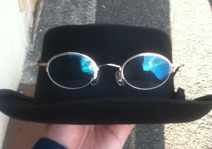

## MORIMOTO Yukihiro
e-mail: sza02290@edu.osakafu-u.ac.jp 
This page is Yukihiro's personal Home Page. 
Newest update:14th October 2019 
[日本語版ホームページはこちら](https://yukihiro00.github.io/Morimoto-Yukihiro/)  

  
 I usual live in fashion styles。

### Self-introduction
*****
MORIMOTO Yukihiro is Mastar's student of Osaka Prefecture University, belong to  Graduate School of Humanities and Sustainable System sciences.  
My majars are Experimental Psychology & cognitive Psychology. My research theme is association between subjective consciousness (or Awareness) and behavior. 
I am mainly interested in various information processing in the human mind,and in particular,I want to explore the process and function of consciousness.  
My Supervisor is Dr MAKIOKA Shogo.  
I am currently a student member of Japanese Society for Cognitive Psychology and the Japanese Cognitive Science Society. 
The specific content of the current study is to present visual stimuli, measure response time and PAS (Perceptual Awareness Scale), and verify how primer visibility affects the response to the target.   

The experiment environment is mainly on Linux OS Ubuntu, and the experiment is configured using MATLAB and Psychtoolbox-3.Currently, I measure the reaction time using a keyboard and joystick, but in the future, I plan to use various devices (For example Motion capture system) and brain waves for measurement. 
The analysis mainly uses  ANOVA, linear mixed model analysis, and general linear mixed model by analysisstatistical software R, but is currently studying to use Bayesian statistics.Recently, I'm also studying python, mainly for data visualization and graphing. 

I am interested in experimental methods and theories, as well as data analysis methods, the construction of new experimental environments,and the sharing of research data and interpretations. 
 

If you could contact me, please email "sza02290@edu.osakafu-u.ac.jp" 

### Participating academic conferences
*****
30th　August  and 1st September 2018, Japanese Cognitive Science Society's 35th Annual Meeting at Ritsumeikan University Ibaraki Campus  
Participate as a audience 

1st-2nd September 2018,Japanese Society for Cognitive Psychology's the 17th Annual Meeting at Ritsumeikan University Ibaraki Campus 
Participate as a audience 

25th - 26th May 2019,Japanese Society for Cognitive Psychology's　the 17th Annual Meeting　at Kyoto Telsa  
*25th poster presentation. Presentation title "Relationship between conscious perception experience and perception response"

29th July - 1st August 2019, Asia Pacific Conference on Vision; APCV2019 at Ritsumeikan University Ibaraki Campus  
Participate as a audience 

5th - 7th September 2019, Japan Cognitive Science Society's 36th Conference at Shizuoka University Hamamatsu Campus  
*5th poster presentation. Presentation title “The effect of subjective visibility on response priming” 

10th - 12th January, 2020　The Vision Society of Japan 2020 Winter Conference at Tokyo Institute of Technology Suzukakedai Campus 
*10th　poster presentation.　Presentation title "Does Prime Visibility Affect Response Priming? -Study using PAS" 

15th -19th May 2020,　Vision Science Society 2020; VSS2020　at the TradeWinds Island Resorts in St. Pete Beach, Florida. 
*plan to 19th　poster presentation.　Presentation title "Effect of subjective visibility on response priming" 
### Brief personal record
*****
April 2015:admission 　College of Sustainable System Science,Osaka Prefectural University 
May   2019:graduate　College of Sustainable System Science,Osaka Prefectural University 
April 2019:admission　Graduate School of Humanities and Sustainable System sciences,Osaka Prefecture University 

### Essay (update:12th October 2019)
*****
I've only lived with the Japanese language, but I made a self-introduction site in English to connect to the world. 
My ugly English is difficult to read, but thank you for visiting the website.If you have the improvement of the homepage,and any questions about research content, or comments, please email me.
