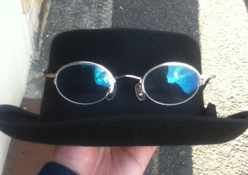

## 森本　優洸聖(もりもと　ゆきひろ)
e-mail: sza02290@edu.osakafu-u.ac.jp 
このページは森本優洸聖の個人ホームページです。 
最終更新日　2019年8月7日  

  
 大抵こんな服飾品を身に着けて生活しています。

### 自己紹介
*****
森本優洸聖は大阪府立大学　人間社会システム研究科　現代システム学専攻 
環境システム学分野　認知行動論コース　博士前期課程1年に所属しています。 
専攻は実験心理学及び認知心理学で，主な研究テーマは主観的意識の有無と行動の関係です。 
大きくはヒトの心における様々な情報処理に関心があり，特に意識の構成過程や機能について探求したいと考えています。 
指導教員は学域・博士前期課程ともに牧岡省吾先生です。  
現在，日本認知心理学会，日本認知科学会の2つの学会の学生会員です。 
具体的な研究内容はプライミングのパラダイムを用いてプライマーの見えの程度がターゲットに対する反応にどのような影響を及ぼすかについて，視覚刺激を使って，反応時間やPAS(Perceptual Awareness Scale)を測定することで検証しています。  
実験環境は主にLinuxOSのUbuntu上で，MATLAB及びPsychtoolbox-3を利用して実験を構成しています。現状はキーボードやジョイスティックを使って反応時間を計測していますが，将来的には様々なデバイス及び，脳波なども計測して研究に使おうと考えています。 
分析は主に統計処理ソフトRを用いて分散分析，線形混合モデル分析及び一般線形混合モデル分析を使っていますが，現在ベイズ統計学を使えるように勉強中です
。 
実験方法や理論についてはもちろんですが，データ分析方法や新しい実験環境の構築，研究データや解釈の共有方法等に興味があります。 
何かの際にお世話になるときはよろしくお願いします。  
ご連絡をいただける際はsza02290@edu.osakafu-u.ac.jpにメールをいただければと思います。 

### 発表・参加した学会及び大会
*****
2018年8月30,9月1日 日本認知科学会　第35回大会　於　立命館大学いばらきキャンパス 
一般聴衆として参加

2018年9月1日~2日 日本認知心理学会　第17回大会　於　立命館大学いばらきキャンパス 
一般聴衆として参加

2019年5月25,26日 日本認知心理学会　第17回大会　於　京都テルサ 
*ポスター発表にて参加　発表演題 「意識的知覚経験と知覚反応の関係」

2019年7月29日~8月1日 Asia Pacific Conference on Vision; APCV2019　於　立命館大学いばらきキャンパス 
一般聴衆として参加

2019年9月5~7日 日本認知科学会　第36回大会　於　静岡大学浜松キャンパス 
*ポスター発表にて参加予定　発表演題 「応答プライミングにおける主観的可視性の効果」

### 略歴
*****
2019年3月　大阪府立大学　現代システム科学域　環境システム学類　人間環境科学課程　卒業 
同年4月　同大学院　人間社会システム科学研究科　現代システム科学専攻　環境システム学分野　博士前期課程　入学 

### 内言と外言の狭間 (2019年8月7日　記載)
*****
これまで研究は極力一人ですすめるものだと思っていたところありましたが，大学院に入学して研究及び学問の本質は他者との知識共有及び意思疎通であると感じ始めました。他者と話をする際には，まず自分がどんな人間なのかを知ってもらうことが大事だと思ったのでプロフィールをまとめたHPを作ってみました。 
名刺を作ってもこのHPのQRコードをつけておけば名刺の情報量は減らせるだろうという魂胆もあります(笑) 
何よりここまで見てもらってありがとうございます。折を見て情報は更新していきます 
もし，旧友がこのページを見つけた場合はとりあえず上記のメールアドレスまで連絡をもらえると嬉しいです。
